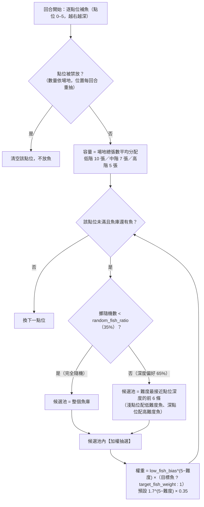

# 蘭嶼釣魚趣 — Laravel 12 全端版

達悟族捕魚桌遊的數位互動版：Laravel 12.x + MySQL 後端 + 原生 Canvas 像素遊戲前端。
**所有遊戲項目皆可於後台動態管理**：魚牌、角色、場地卡、命運卡、拉竿卡、自然的反撲、遊戲參數。

## 架構

```
app/
  Http/Controllers/GameConfigController.php   # GET /api/game-config（快取，後台異動自動失效）
  Http/Controllers/Admin/AdminController.php  # 註冊表驅動 CRUD（七種實體共用）
  Http/Controllers/Admin/AuthController.php   # 極簡密碼登入（ADMIN_PASSWORD）
  Http/Middleware/AdminAuth.php
  Models/…                                    # FishSpecies / Role / SiteCard / DestinyCard / ActionCard / EnvCard / GameSetting
database/
  migrations/2026_07_03_000001_create_game_tables.php
  seeders/GameDataSeeder.php                  # 完整遊戲資料（含勝率校準後的牌組配比）
resources/views/
  game.blade.php                              # 遊戲頁（/），以 @vite 載入打包資產
  layouts/admin.blade.php + admin/…           # 後台
resources/game/
  game.js / game.css / data/ utils/ config/ state/ renderer/
                                              # 遊戲源碼（ES modules；Vite 打包為 public/build/assets/game-<hash>）
scripts/simFishDistribution.mjs               # 魚種出現機率無頭模擬（見下方「魚種出現機制」）
routes/web.php
```

## 安裝

```bash
composer install
cp .env.example .env && php artisan key:generate
# .env 設定 MySQL 連線（DB_DATABASE=lanyu_fishing 等）與 ADMIN_PASSWORD
php artisan migrate --seed
php artisan serve
```

- 遊戲：http://127.0.0.1:8000/
- 後台：http://127.0.0.1:8000/admin（密碼 = `.env` 的 `ADMIN_PASSWORD`）
- 設定 API：GET `/api/game-config`

## 動態管理重點

| 後台項目 | 對應玩法 |
|---|---|
| 魚牌 | 魚種、張數、難度（＝捕獲判定門檻）、像素圖參數 |
| 場地卡 | 判定邏輯（≥/>）、限制點位、場上總張數、場景視覺 |
| 命運卡 / 拉竿卡 | 三欄張數＝低/中/高難度的牌組配比。**兩段式設計（2026-07-06 改造）**：命運卡只回答「魚咬不咬餌」（環境與運氣，go 類只有「中魚」）；拉竿卡決定收線結果（單鉤判定/雙鉤 2 條/吞鉤白拿+休息/脫鉤/纏線/鑽礁）。吞鉤/雙鉤命運卡保留但張數 0，後台可重新啟用 |
| 自然的反撲 | 回合結束事件的張數與文案 |
| 遊戲設定 | 回合數、集體目標、隱藏機率區座標、補魚隨機比例、魚種權重（`low_fish_bias`／`target_fish_weight`）、音樂加速回合 |

後台另有 **📊 勝率試算**（`/admin/simulator`）：改參數前先在瀏覽器跑無頭模擬（與遊戲同一條資料路徑），
對照現行設定看每個場地的集體勝率變化，滿意再到「遊戲設定」正式儲存。

後台任何儲存都會清除 `game-config` 快取；玩家重新整理遊戲頁即取得最新設定。
前端動畫以 `key` 對應（新增卡片時沿用既有 key 可重用動畫，未知 key 會以文字卡呈現）。

## 魚種出現機制（2026-07-05 難度調整後）

每回合開始時系統為 6 個點位「補魚」。一條魚會不會出現在場上，由**三層機制**依序決定：



**加權抽選是這次難度調整的核心**：
- `low_fish_bias`（預設 **1.7**）：難度每低一級，被抽中的權重乘 1.7 倍 → diff 1 的魚權重是 diff 5 的約 8.4 倍，**低難度魚大量出現**。
- `target_fish_weight`（預設 **0.35**）：目標魚（Ilek／Cilat／Acyod／Tapez）權重再打 65 折 → **目標魚明顯變稀有**，個人任務更難完成。
- 兩者設為 `1` 即回到調整前的均勻抽選。

### 各場地層級的魚種分佈（模擬 20,000 次開局，random_fish_ratio=0.35）

場地層級：**低階**（判定 ≥，總 10 張）＝龍門港內、紅頭村前方海灘、椰油村開元港、漁人村潮間帶、朗島避風港；**中階**（判定 ≥，總 7 張）＝八代灣外緣、東清灣礁石區、五孔洞海域、坦克岩周邊、雙獅岩外海；**高階**（判定 >，總 5 張）＝小蘭嶼黑水溝、青青草原崖下、大天池下海口、饅頭岩急流區、東清外海大浪區。

調整前（均勻抽選）：

| 層級 | diff1 | diff2 | diff3 | diff4 | diff5 | 目標魚占比 | 開局場上有目標魚 |
|---|---|---|---|---|---|---|---|
| 低階 | 23.9% | 27.8% | 13.8% | 15.6% | 19.0% | 22.1% | 95.9% |
| 中階 | 26.2% | 29.5% | 12.9% | 12.2% | 19.2% | 20.9% | 86.5% |
| 高階 | 24.5% | 27.6% | 13.5% | 13.8% | 20.6% | 22.6% | 72.0% |

**調整後（現行預設 1.7 / 0.35）**：

| 層級 | diff1 | diff2 | diff3 | diff4 | diff5 | 目標魚占比 | 開局場上有目標魚 |
|---|---|---|---|---|---|---|---|
| 低階 | 31.3% | 28.7% | 12.8% | 13.5% | 13.8% | **12.3%** | 79.8% |
| 中階 | 34.0% | 30.2% | 11.6% | 9.7% | 14.6% | **11.6%** | 64.4% |
| 高階 | 32.3% | 28.4% | 12.4% | 11.8% | 15.1% | **12.4%** | 48.6% |

```mermaid
xychart-beta
  title "目標魚占場上比例（%）— 調整前 vs 調整後"
  x-axis ["低階場地", "中階場地", "高階場地"]
  y-axis "占比 %" 0 --> 25
  bar [22.1, 20.9, 22.6]
  bar [12.3, 11.6, 12.4]
```



單一目標魚的開局出現率（每 100 場開局、場上平均張數）：

| 層級 | Ilek | Cilat | Acyod | Tapez |
|---|---|---|---|---|
| 低階（調整前 → 後） | 31.6 → 17.9 | 63.2 → 37.3 | 63.7 → 37.0 | 62.1 → 30.3 |
| 中階（調整前 → 後） | 22.4 → 13.7 | 45.6 → 26.0 | 44.4 → 27.1 | 33.9 → 14.3 |
| 高階（調整前 → 後） | 17.3 → 9.7 | 34.3 → 19.7 | 33.9 → 20.1 | 27.4 → 12.6 |

> 注意：以上為「開局第一次補魚」的分佈。整場 15 回合中魚被釣走後會持續補魚，目標魚仍會逐步進場，搭配「耆老分魚」機制，個人任務仍可完成、只是更需要挑對場地與時機。

### 想再調整難度？

1. 後台「遊戲設定」直接改 `low_fish_bias`、`target_fish_weight`（儲存即清快取，玩家重整生效）。例如更狠的 `2.2 / 0.2` 會把目標魚占比再壓到 ~9%。
2. 改前先跑模擬看數字：`node scripts/simFishDistribution.mjs 2.2 0.2`（補魚分佈）、`node scripts/simGame.mjs 2000 15 3,4,5`（整場勝率，環境變數 `LOW_BIAS`/`TGT_W`/`GOAL` 可覆寫）
3. 機制實作在 `resources/game/utils/board.js` 的 `fishWeight()` 與 `refillBoard()`，回歸測試在 `tests/js/utils/board.test.js`。

## Zeabur 部署備忘

- PHP 服務指向本專案，`DB_*` 指到 MySQL 服務；持久化不需 Volume（純資料庫）。
- 首次部署後執行 `php artisan migrate --seed`。
- 之後若有新 migration（如 2026_07_05 魚種權重設定），部署後需再執行 `php artisan migrate`；未執行時前端使用相同的內建預設值，功能不受影響，僅後台看不到該設定列。
